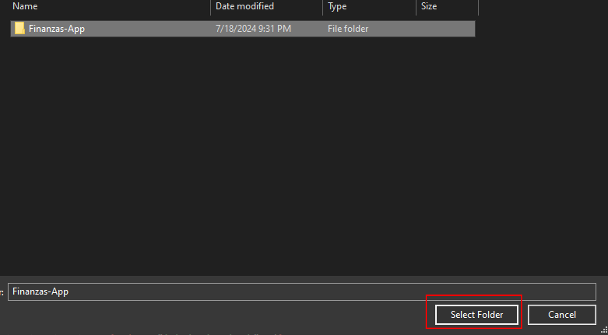

# Finanzas App
## Descripción
Finanzas App es una aplicación web mediante la cual se puede calcular el valor de cuentas bancarias a lo largo del tiempo. En esta se puede ingresar varias cuentas bancarias por usuario y calcular su valor dependiendo del tipo de cuenta. Además se podrá realizar estimaciones del valor de la cuenta si es que se cambiase por otras opciones de intereses.
## Objetivos
#### General
- Desarrollo de una aplicación web en la que se registre y calcule el valor de una cuenta bancaria en un tiempo establecido por el usuario y estime el valor con otros tipos de intereses.
#### Específicos
- Recopilación de requerimientos
- Creación de mockups
- Desarrollo de frontend de acuerdo a los mockups
- Desarrollo de backend con Node.js de acuerdo con los requerimientos anteriormente establecidos
- Creación de una instancia de base de datos en MongoDB
- Reproducción de la aplicación en un entorno local
## Resultados
#### Inicio de sesión
La aplicación nos pedirá nuestro nombre de usuario y contraseña para ingresar a la aplicación. 

#### Registro de usuario 
Para registrarse en la aplicación se requerirá el nombre del usuario, email y contraseña. No se permitirá crear más de un usuario con el mismo nombre y email.

#### Creación de cuenta bancaria a calcular
En la aplicación debemos indicar el tipo de tasa que se aplica a la cuenta, el porcentaje, moneda, el período, monto inicial y en caso de ser una tasa nominal indicar el tipo de capitalización.

#### Visualización de cuentas bancarias
En el menú principal se pueden visualizar las cuentas que se tienen con información adicional sobre el tipo de cuenta.

#### Cálculo del valor en el futuro
Al seleccionar una cuenta desde el menú principal se podrá calcular el valor de la cuenta en la cantidad de días que indique el usuario y se podrá calcular el valor con otras configuraciones o actualizar dicha cuenta con otras configuraciones.

## Reproducción en entorno local
#### Prerequisitos
Para reproducir la aplicación se debe contar con:
- MongoDB instalado
- Node.JS instalado
- Visual Studio Code
- Tener configurado un navegador predeterminado

#### Inicio de la aplicación
##### Paso 1
En Visual Studio Code se abre el folder de la aplicación "Finanzas-App".
 

 

##### Paso 2
Se abre un terminal seleccionando "vista" o "view" y luego seleccionando "terminal".
 

 

 
##### Paso 3 
En el terminal se escribe cd backend y se presiona enter para dirigirnos a la carpeta del backend. Luego, para instalar las dependencias necesarias se escribe "npm install -g nodemon".
 

 
##### Paso 4
Luego se escribe "nodemon server.js" para iniciar el servidor local.
 

 
###### Nota
Si aparece un error iniciamos poweshell en modo administrador, escribimos "Set-ExecutionPolicy" RemoteSigned, presionamos enter, seleccionamos la opción "Yes to All" y presionamos enter. A continuación regresamos a Visual Studio Code y ejecutamos el comando "nodemon server.js"
 

 

 
##### Paso 5
Nos dirigimos al apartado de extensiones y buscamos "Live Server" y lo instalamos.
 

 
##### Paso 6
Vamos al archivo html "Login" hacemos click derecho en el código y click en "Open with Live Server". Con esto se abrirá una nueva pestaña en nuestro navegador predeterminado con la aplicación.
 

 
## Aprendizaje
Gracias a este proyecto aprendí:
- A crear un backend en Node.js y gestionarlo con la herramienta Nodemon.
- A realizar fetch requests con javascript.
- A enlazar instancias de bases de datos MongoDB.
- A utilizar animaciones simples.
